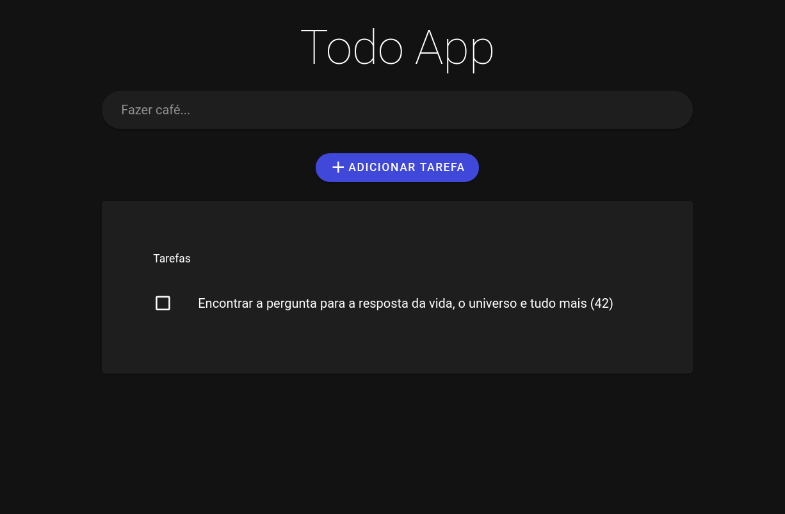

# todo-vue

## App

Github Pages:

> https://guilnorth.github.io/todo-vue/


## Project setup
```
yarn install
```

### Compiles and hot-reloads for development
```
yarn serve
```

### Compiles and minifies for production
```
yarn build
```

### Lints and fixes files
```
yarn lint
```

